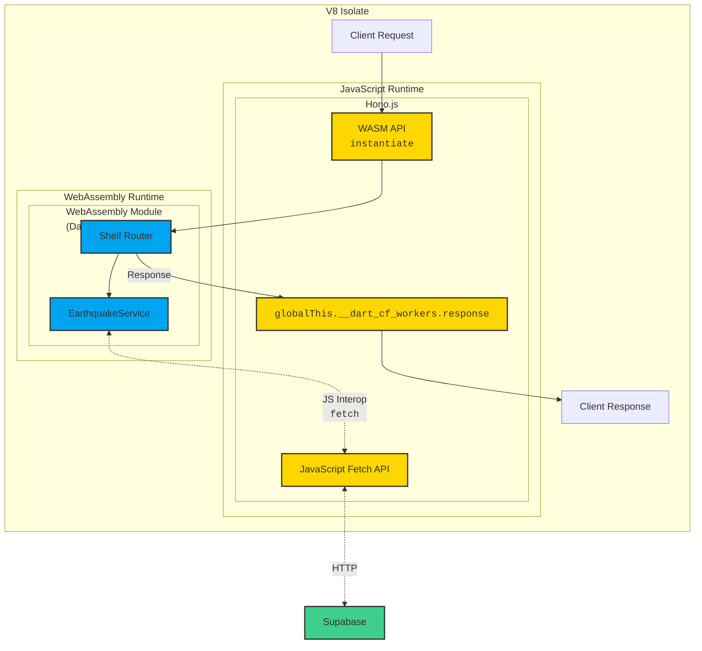

# EQAPI Dart Edge

Dart WASM on Cloudflare Workersの動作検証用API

## 概要

- JavaScriptからDart(WebAssembly)を起動し APIをハンドリング
  - Dartでは Shelfを利用しルーティングを行う
  - DartからJavaScript Interopを利用し、JavaScriptのFetch APIを呼び出す
- Cloudflare WorkersのV8 Isolateモデルを活用し、効率的なリクエスト処理を実現

## V8 Isolateについて

Cloudflare Workersは、V8 JavaScriptエンジンのIsolateモデルを活用しています。V8 Isolateは：

- 各リクエストを独立したメモリ空間で処理
- リクエスト間のコンテキスト分離によるセキュリティ向上
- 高速な起動と終了が可能
- 同時に多数のリクエストを効率的に処理

このプロジェクトでは、V8 Isolate内でDart WASMインスタンスを実行し、Isolateの寿命中はWASMインスタンスを再利用することでパフォーマンスを最適化しています。

V8 Isolateから外部サービス（Supabase）へのアクセスは、JavaScriptのFetch APIを経由して行われます。Dart WASM内のEarthquakeServiceはJavaScript Interopを通じてFetch APIを呼び出し、外部のSupabaseサービスとHTTP通信しています。

## アーキテクチャの詳細

V8 Isolate内には、JavaScriptランタイムとWebAssemblyランタイムが存在します：

1. **JavaScriptランタイム**：Hono.jsなどのJavaScriptコードを実行し、Fetch APIなどの外部通信機能を提供
2. **WebAssemblyランタイム**：Dartコードを変換したWASMモジュールを実行

この2つのランタイム間では、以下のようなやり取りが行われます：

- JSランタイムがWASMファイルをロードし、WebAssemblyランタイムに渡す
- Dartコードは、JavaScript Interopを通じてFetch APIなどのJavaScript機能を呼び出す
- クライアントへのレスポンスは、WASM Runtime内のDartモジュールから`globalThis.__dart_cf_workers.response`を通じてJavaScriptランタイムのPromiseにresolveされる
