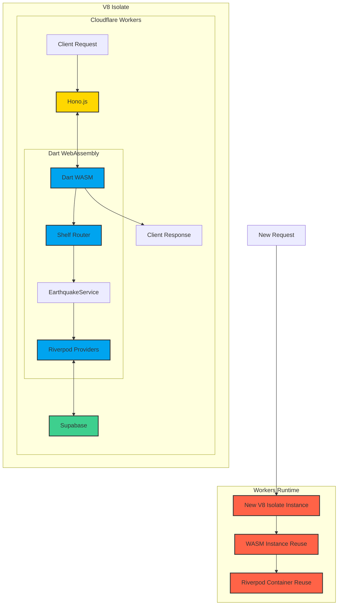

# eqapi-dart-edge: Dart と WebAssembly による Cloudflare Workers 上の地震情報 API サービス

こんにちは、[YumNumm（Ryotaro Onoue）](https://twitter.com/YumNumm)です。

本記事では、dart-edge を使って Cloudflare Workers 上で動作する地震情報 API サービス「eqapi-dart-edge」の実装について解説します。

## プロジェクト概要

このプロジェクトでは、Dart コードを WebAssembly（WASM）にコンパイルし、Cloudflare Workers 上で実行する API サーバーを実装しています。主な特徴は以下の通りです：

- Dart のコードを WASM にコンパイルして Cloudflare Workers で実行
- Riverpod を利用した依存性注入
- Supabase からの地震データの取得
- Hono フレームワークによるミドルウェア実装
- Cloudflare Workers の V8 Isolate モデルを活用した効率的なリクエスト処理

## アーキテクチャ図



## 技術スタックの解説

### 1. フロントエンド（JavaScript/TypeScript）

Hono.js を使用して、Cloudflare Workers 上でミドルウェアやルーティングを実装しています。主な役割は：

- WASM インスタンスの初期化と再利用
- リクエスト/レスポンスの橋渡し
- セキュリティやパフォーマンス関連のミドルウェア適用
- エラーハンドリング

### 2. バックエンド（Dart/WebAssembly）

Dart コードを WebAssembly にコンパイルして実行しています。主なコンポーネントは：

- **Shelf フレームワーク**: HTTP リクエスト/レスポンスを処理
- **Shelf Router**: エンドポイントのルーティングを管理
- **Riverpod**: 依存性注入とステート管理
- **Supabase クライアント**: データベースとの通信

### 3. データストア（Supabase）

Postgres データベースをベースにした Supabase を使用して、地震データを保存・取得しています。

### 4. V8 Isolate

Cloudflare Workers は、Google V8 JavaScript エンジンの Isolate モデルを活用しています：

- 各リクエストを独立したメモリ空間で処理
- 軽量かつ高速な起動と終了が可能
- メモリ使用量の制限と監視
- 同時に多数のリクエストを効率的に処理

このプロジェクトでは、V8 Isolate 内で Dart WASM インスタンスを実行し、Isolate の寿命中は WASM インスタンスと Riverpod Container を再利用することでパフォーマンスを最適化しています。

## 実装の詳細

### JavaScript と Dart の橋渡し

WebAssembly と JavaScript の間でデータをやり取りするため、グローバル変数 `__dart_cf_workers` を使用しています：

```typescript
globalThis.__dart_cf_workers = {
  request: () => c.req.raw,
  response: (response: Response) => resolve(response),
  env: () => c.env,
  ctx: () => c.executionCtx,
};
```

これにより、Dart 側からリクエストオブジェクトを取得し、レスポンスを返すことができます。

### WASM インスタンスの再利用

パフォーマンス向上のため、WASM インスタンスをリクエスト間で再利用しています：

```typescript
// グローバル変数に保持
let dartInstance: unknown | null = null;

// 初期化は一度だけ
if (!dartInstance) {
  dartInstance = await instantiate(mod);
}
```

### Riverpod による状態管理

Dart 側では Riverpod を使用して依存性を注入し、グローバルなコンテナを再利用しています：

```dart
// グローバル変数としてコンテナを保持
ProviderContainer? _container;
ProviderContainer get container => _container!;

// 初期化
_container ??= ProviderContainer(
  overrides: [envProvider.overrideWithValue(jsEnv)],
);
```

### Shelf を使用したAPI実装

地震データを取得するエンドポイントは Shelf Router を使用して実装しています：

```dart
@Route.get('/earthquake/list')
Future<Response> list(Request request) async {
  final supabase = container.read(supabaseProvider);
  // リクエストパラメータの取得・検証
  // Supabaseからデータ取得
  // JSONレスポンスの返却
}
```

## パフォーマンスと最適化

このアーキテクチャには以下のようなパフォーマンス上の利点があります：

1. **V8 Isolate の活用**: 軽量で高速なリクエスト処理
2. **WASM インスタンスの再利用**: リクエスト間で WASM インスタンスを再利用
3. **ProviderContainer の再利用**: Riverpod の ProviderContainer をリクエスト間で再利用
4. **パフォーマンス計測**: Hono の timing ミドルウェアによる実行時間の計測
5. **エッジでの分散実行**: Cloudflare Workers のグローバルネットワークを活用

## まとめ

このプロジェクトは、Dart コードを Cloudflare Workers 上で実行するための実装例です。dart-edge を使用することで、Dart の型安全性や豊富なライブラリエコシステムを活用しつつ、Cloudflare Workers のグローバル分散インフラの恩恵を受けることができます。

地震情報 API のような実用的なユースケースで、Dart、WASM、Cloudflare Workers の組み合わせが有効に機能することを示しています。

## 今後の発展性

- **キャッシュの実装**: Cloudflare Workers の KV や Cache API を活用した高速なレスポンス
- **ストリーミングレスポンス**: 大量のデータを効率的に返すためのストリーミング実装
- **認証機能**: JWT などを用いた API 認証の実装
- **WebSocket サポート**: リアルタイム更新のための WebSocket の実装

## 参考リンク

- [dart-edge パッケージ](https://pub.dev/packages/dart_edge)
- [Cloudflare Workers ドキュメント](https://developers.cloudflare.com/workers/)
- [Hono フレームワーク](https://hono.dev/)
- [Supabase ドキュメント](https://supabase.io/docs)
- [V8 Isolates](https://developers.cloudflare.com/workers/learning/how-workers-works/#isolates)

## ソースコード

プロジェクトのソースコードは [GitHub リポジトリ](https://github.com/YumNumm/eqapi-dart-edge) で公開されています。
